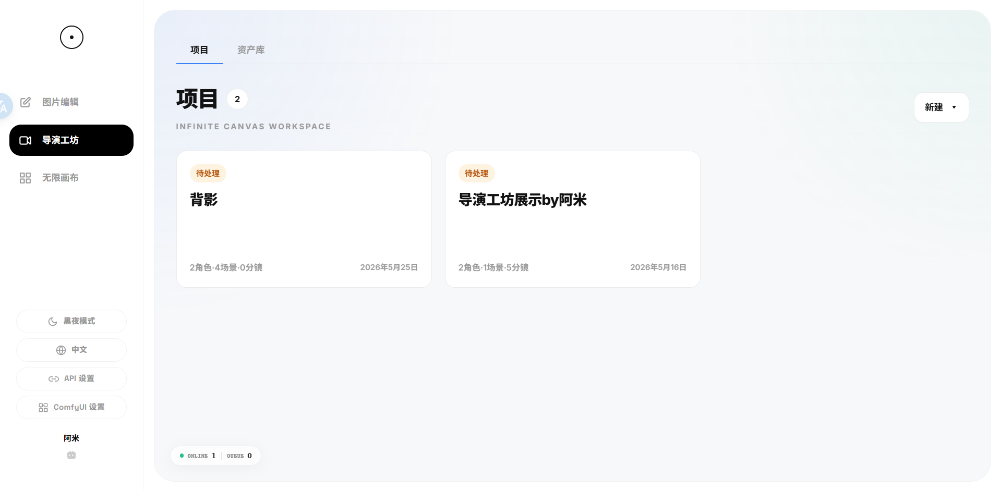
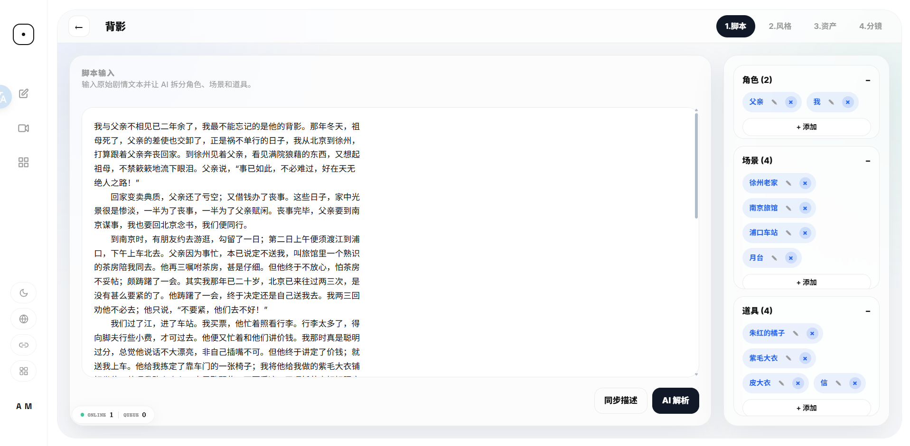
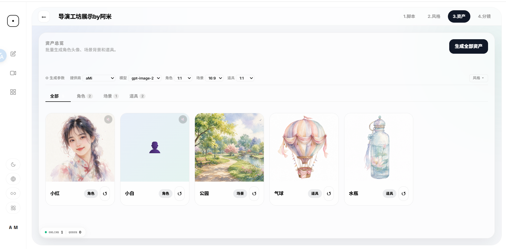
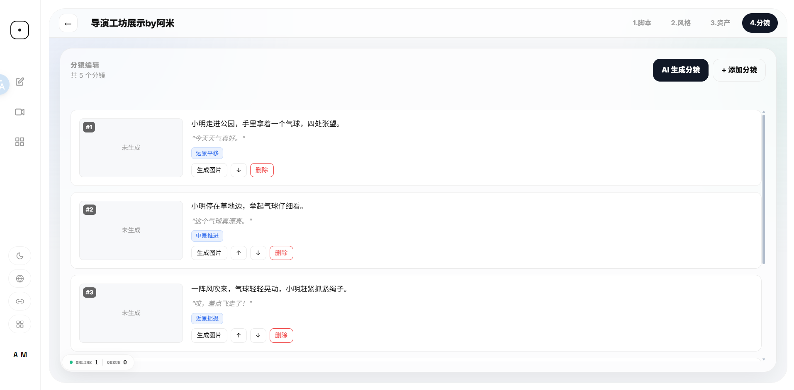
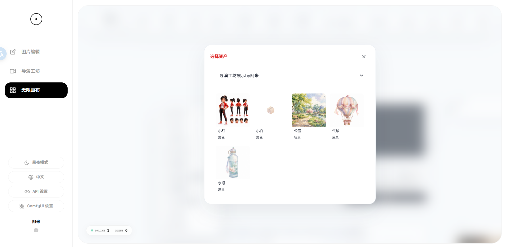
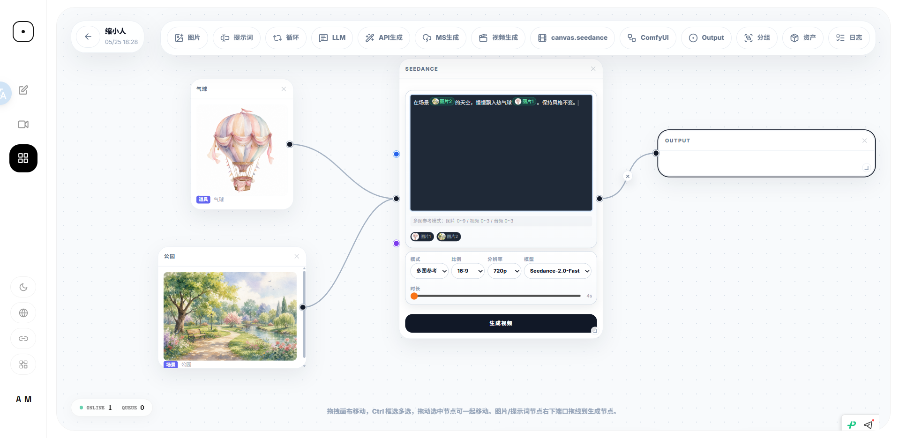
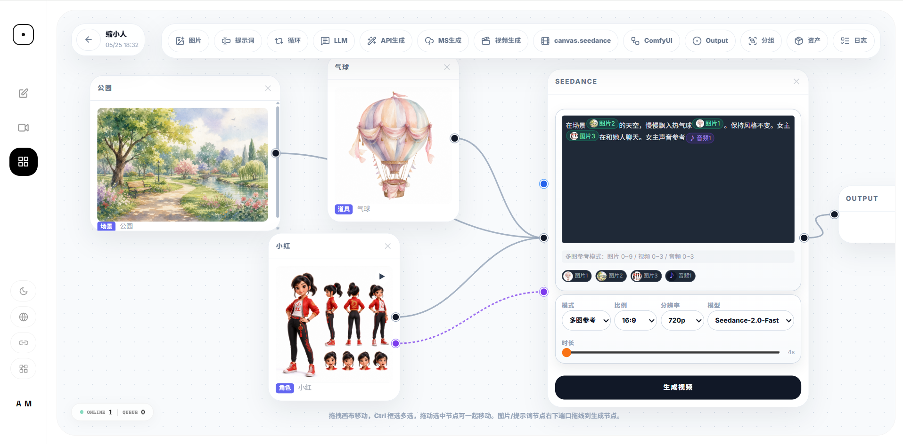

# Infinite-Canvas

基于大熊版本深度二开版本的 AI 工作台，专注项目级别的视频工作流。相较原始项目偏单点生成的工作方式，本项目新增了一套“从剧本到资产到分镜”的导演式工作流，核心入口是左侧导航的“导演工坊”。同时，无限画布新增对seedacne2.0全能力支持的卡片。部分移除类目，后续会以更加贴合本项目的方式嵌入。

## 导演工坊模块

- **工作台首页**：提供“项目 / 资产库”双标签，可新建系列或单集，并统一管理入口。
- **系列管理**：系列页可维护剧集列表，以及系列级共享的角色、场景资产，适合做连载或长篇内容规划。
- **项目编辑器**：单集项目页拆成 4 个阶段：`1.脚本` → `2.风格` → `3.资产` → `4.分镜`。
- **AI 解析脚本**：可从原始剧情文本中自动提取角色、场景、道具，并写回项目数据。
- **风格设定**：支持风格预设、AI 推荐、自定义正负提示词，以及提供商 / 模型 / 画幅比例配置。
- **资产生成**：支持批量生成角色、场景、道具资产，并提供变体选择、收藏、锁定参考、重新生成等能力。
- **分镜生成**：可基于脚本与已提取实体自动生成分镜，也支持手动增删、排序，并对单帧直接出图。
- **前后端联动**：前端主要落在 `static/workspace.html`、`static/series.html`、`static/project.html`；后端主要通过 `main.py` 中 `/api/comic/*` 接口完成项目管理、LLM 解析和图片生成。

## 无限画布中的 Seedance 2.0 定制卡片

- **独立视频节点**：在无限画布里单独提供 Seedance 节点，默认使用 `Seedance-2.0`。
- **三种参考模式**：支持 `单图`、`首尾帧`、`多图参考` 三种模式，适配不同视频生成方式。
- **素材 token 引用**：支持把已连接的图片 / 视频 / 音频素材转成 token 插入提示词，便于在画布里做多素材引用。
- **模式限制可视化**：会按当前模式校验图片、视频、音频可引用数量，并在卡片内直接提示超限状态。
- **参数面板重组**：把模型、比例、分辨率、时长这些高频参数集中在一张卡片里，便于快速调参与连续出片。
- **接入画布链路**：该卡片可以直接接入无限画布现有节点流转，与图片、视频、输出链路组合成完整工作流。
- **实现位置**：主要前端实现位于 `static/canvas.html`，视频请求通过后端接口发出。

-----

